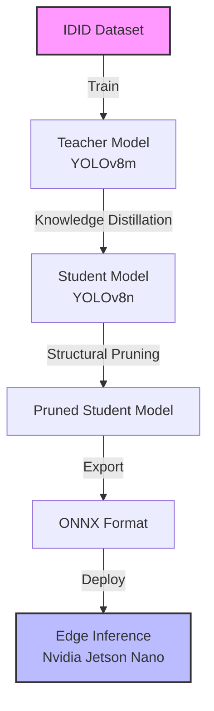
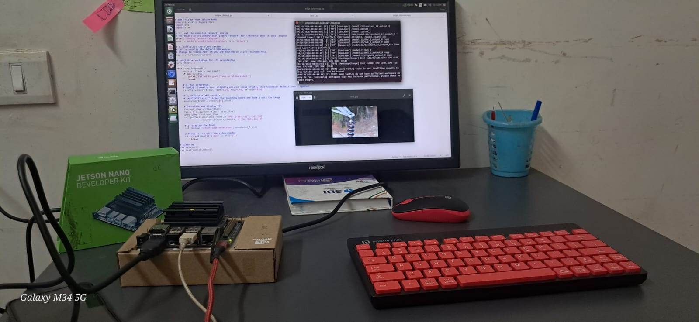
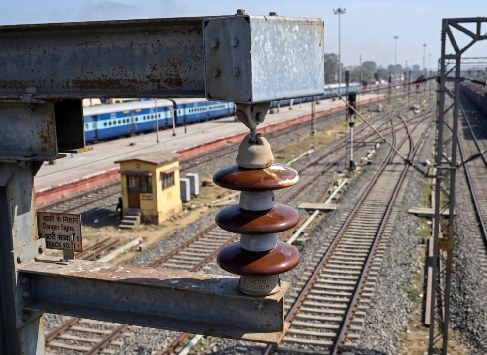
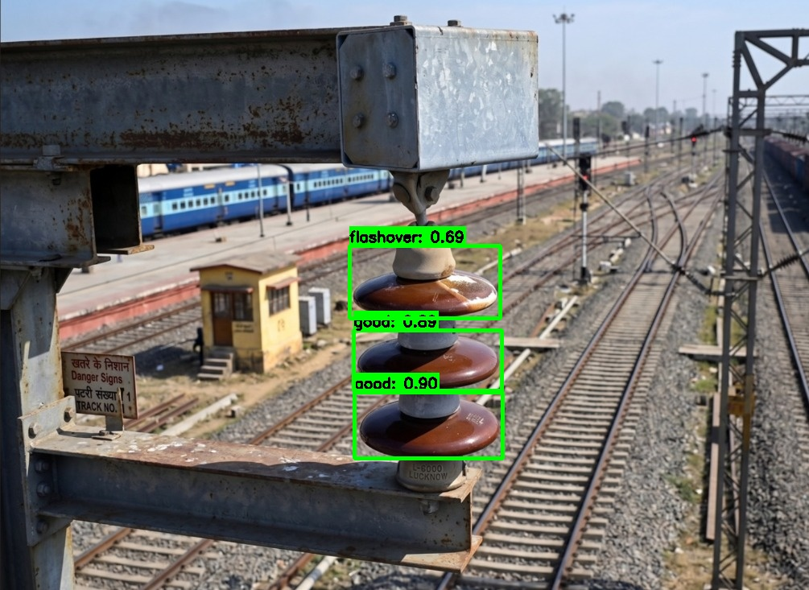

# Edge Deployable Deep Learning Model For Image Analysis
### video link:
https://drive.google.com/file/d/19oFZnLerR7BqzS7DQgBRUjD6ly3CpQe3/view?usp=sharing


This repository contains the complete pipeline for an edge-deployable computer vision model designed to analyze images and detect insulator defects. The model is trained to be lightweight and optimized, ensuring it runs efficiently on edge devices like the **Nvidia Jetson Nano**.

## Table of Contents
- [Dataset](#dataset)
- [System Architecture](#system-architecture)
- [Repository Structure](#repository-structure)
- [Execution Workflow & Environments](#execution-workflow--environments)
  - [Phase 1: Training & Optimization](#phase-1-training--optimization-environment-kaggle--google-colab)
  - [Phase 2: Edge Deployment](#phase-2-edge-deployment-environment-nvidia-jetson-nano--local-pc)
- [Visual Results](#visual-results)
- [How to Run Inference](#how-to-run-inference)
- [Contributors](#contributors)
- [License](#license)

## System Architecture

The pipeline follows a robust teacher-student knowledge distillation approach, combined with structural pruning and ONNX conversion to guarantee real-time performance on edge devices.



## Dataset
link : https://www.kaggle.com/competitions/insulator-defect-detection/data

The model was trained and evaluated on the **Insulator Defect Detection Dataset (IDID)** and **open source Internet Image**. The dataset consists of images categorized into three main classes:
- `0: good`
- `1: broken`
- `2: flashover`

## Repository Structure

```text
├── data/
│   └── sample_images/       # Sample images for testing the model
├── deployment/              # Edge deployment scripts (Jetson Nano/Local PC)
│   ├── app.py               # Streamlit web UI for defect diagnosis
│   ├── best.onnx            # Final optimized ONNX model
│   ├── test2.py             # Batch image inference script
│   └── webcam_inference.py  # Real-time webcam inference script
├── docs/                    # Project reports and presentations
├── models/                  # PyTorch model weights (.pt)
│   ├── pruned_model.pt      # Pruned YOLOv8 model
│   ├── student_model.pt     # Distilled YOLOv8 student model
│   └── teacher_model.pt     # Heavy baseline YOLOv8 teacher model
├── training/                # Jupyter Notebooks for the training pipeline
│   ├── preprocessing_teacher.ipynb
│   ├── student_training.ipynb
│   ├── pruning.ipynb
│   └── onnx_conversion.ipynb
├── requirements.txt         # Project dependencies
└── README.md                # Project documentation
```

---

## 🚀 Execution Workflow & Environments

The development of this project was split across cloud GPUs (for training) and Edge Devices (for inference).

### Phase 1: Training & Optimization (Environment: Kaggle / Google Colab)
All `.ipynb` files in the `training/` folder were executed on cloud platforms (Kaggle/Google Colab) to leverage powerful GPUs. The workflow is strictly sequential:

1. **`preprocessing_teacher.ipynb`**: Preprocesses the IDID dataset and trains the heavy baseline teacher model (`teacher_model.pt`).
2. **`student_training.ipynb`**: Applies Knowledge Distillation to transfer knowledge from the heavy teacher to a lightweight student model (`student_model.pt`).
3. **`pruning.ipynb`**: Structurally prunes the student model to reduce its parameter count and physical size while maintaining accuracy (`pruned_model.pt`).
4. **`onnx_conversion.ipynb`**: Converts the final optimized PyTorch model to the ONNX format (`best.onnx`) for high-speed inference on edge devices.

### Phase 2: Edge Deployment (Environment: Nvidia Jetson Nano / Local PC)
Once the `best.onnx` model was generated, it was transferred to the **Nvidia Jetson Nano** for real-time edge deployment.

#### Jetson Nano Setup Requirements
Before running the deployment scripts on the Jetson Nano, ensure your device is flashed with the appropriate NVIDIA JetPack SDK. 
- [Official Nvidia Jetson Nano Developer Kit Setup Guide](https://developer.nvidia.com/embedded/learn/get-started-jetson-nano-devkit)

> **Note:** The `deployment/` folder includes an `onnxruntime_gpu-1.11.0-cp38-cp38-linux_aarch64.whl` file, which is specifically required for enabling hardware-accelerated ONNX inference on the Jetson's ARM64 architecture.

---

## Visual Results

### Hardware Setup
<p align="center">
  
</p>

### Sample Inference (Input vs Output)
| Input Image | Jetson Nano Output |
| :---: | :---: |
|  |  |

---

## 🛠️ How to Run Inference

You can run the deployment scripts on a Jetson Nano or your Local PC (using CPU/GPU). 

### 1. Install Dependencies
```bash
pip install -r requirements.txt
```
*(If on Jetson Nano, install the provided ONNX Runtime `.whl` wheel manually: `pip install deployment/onnxruntime_gpu-1.11.0-cp38-cp38-linux_aarch64.whl`)*

### 2. Navigate and Activate Environment
```bash
cd deployment
source venv/bin/activate  # Or your appropriate virtual environment activation command
```

### 3. Choose your Inference Method:

- **Batch Image Processing** (Processes images from `data/sample_images/`):
  ```bash
  python test2.py
  ```

- **Real-Time Webcam Processing**:
  ```bash
  python webcam_inference.py
  ```

- **Interactive Web UI (Streamlit)**:
  ```bash
  streamlit run app.py
  ```

> **Note:** When you are done, you can exit the virtual environment by running `deactivate`.

Processed output images and logs will automatically be saved to the `deployment/output/` directory.

---

## 👥 Contributors

**Batch No. 9**
- **Gaurav Chhajed (522261)** - [GauravChhajed](https://github.com/GauravChhajed)
- **Jay Kishan (522136)** - [Jaysah02](https://github.com/Jaysah02)
- **Abhishek Singh (522101)** - [singhabhi137](https://github.com/singhabhi137)

**Supervisor:**
- [Dr. Sri Phani Krishna Karri](https://github.com/spkkarri)
---

**GitHub Repository:** [Edge_deployable_DeepLearning_Model_for_Image_Analysis](https://github.com/GauravChhajed/Edge_deployable_DeepLearning_Model_for_Image_Analysis)

---

## License

This project is licensed under the [MIT License](LICENSE).
